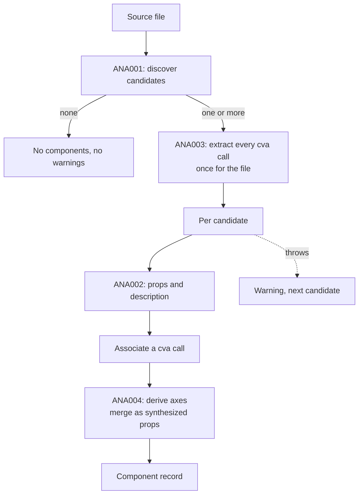
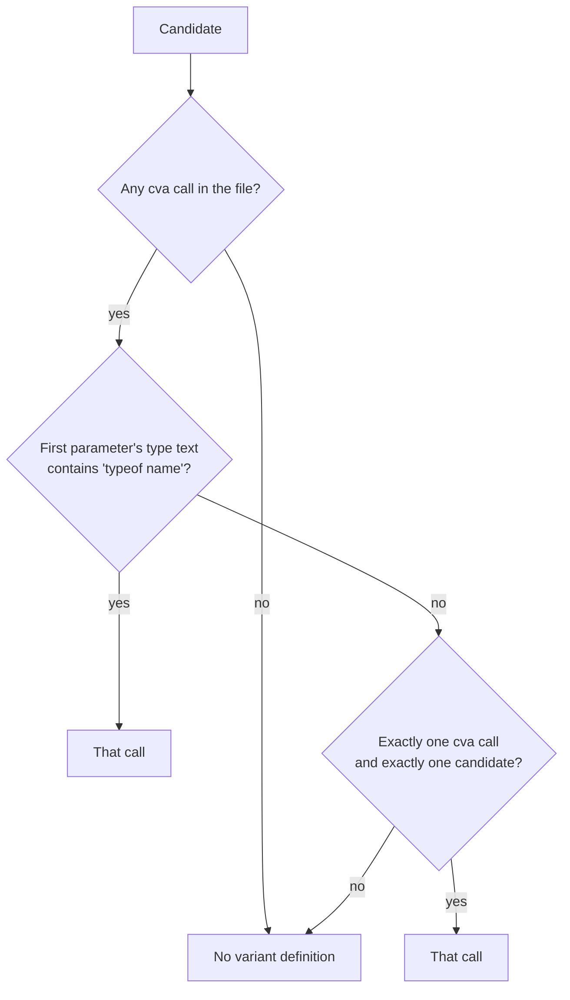

# Manifest assembly

## Overview

Joins the extraction stages into one record per component. It runs discovery, asks the adapters what they found, decides which variant definition belongs to which component, and merges the two views of a component's props into one list.

## Requirements

Satisfies, from [analysis](../requirements.md#analysis):

> Combine discovery and the adapters' output into one record per component, isolating a failure to the component that caused it. _(Prototype)_

## Design

The input is a source file and the project root; the output is a list of component records and a list of warnings.

A file with no candidates returns nothing, and no cva extraction runs. Otherwise the cva calls are extracted once for the whole file and reused for every candidate in it.

**Associating a variant definition with a component.** For each candidate, in order:

1. The first cva call whose local name appears as `typeof <name>` in the text of the candidate's first parameter — either its type node or the source text of its type's declarations.
2. Failing that, if the file holds exactly one cva call and exactly one candidate, that call.
3. Failing that, none. The component is recorded with no variant definition.

**Merging props.** The declared props from [ANA002](ANA002_react-props-adapter.md) come first, in their original order. Each variant axis from [ANA004](ANA004_variant-matrix.md) whose name is not already a declared prop is appended as a synthesized prop:

- **type** is the union of the option names as quoted literals. An axis whose options are exactly `true` and `false` becomes `boolean` instead.
- **defaultValue** is the JSON encoding of the axis's entry in `defaultVariants`, when there is one.
- **required** is always false, and **source** is `cva`.

An axis that shares a name with a declared prop contributes nothing; the declared prop wins, since it carries the author's own type and documentation.

**Identity and paths.** A component's id is its file path and its name joined by `#`. The path is relative to the project root and always uses forward slashes, so an id is the same on every platform.

**Isolating failures.** Each candidate is processed independently. A failure produces a warning naming the component's id and the error message, and the remaining candidates in the file are still processed. One malformed component costs its own record, not the file's.

Reading the parameter for step 1 is itself a source of such failures. It demands a value declaration for the first parameter and throws when there is none, which is what happens for a component typed as a union of function signatures. Such a component is recorded as a warning, not as a component with no props, even though [ANA002](ANA002_react-props-adapter.md) would have tolerated the same condition on its own.

## Notes

**The association rule is a substring match, and it is the known weak point here.** Step 1 tests whether the text `typeof <name>` occurs anywhere in the printed parameter type. A component whose props type mentions a cva variable it does not actually use matches it; a component that derives its variant props through an indirection that erases the `typeof` does not. Step 2 is narrower still: it is a guess that holds only because one component and one variant definition in a file leaves nothing to confuse.

Resolving this is the reason ANA006 exists. An adapter that is asked "which variant definition belongs to this component" can answer from the symbol graph rather than from printed text. Until then, a file with two components and two cva calls, neither written with `VariantProps<typeof …>`, records both components with no variants and no warning.

**Silence on a failed association.** Steps 1 and 2 falling through produces no warning. A component that should have had variants and did not is indistinguishable in the manifest from one that genuinely has none.

**This stage runs once per file, not once per project.** Walking a project, calling this for each of its source files, and wrapping the results in a catalog is [MAN003](../manifest/MAN003_catalog-generation.md).
