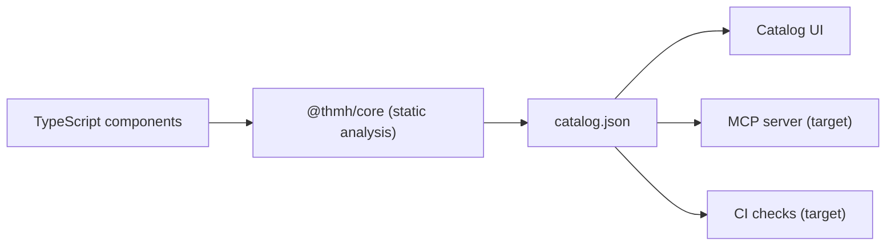
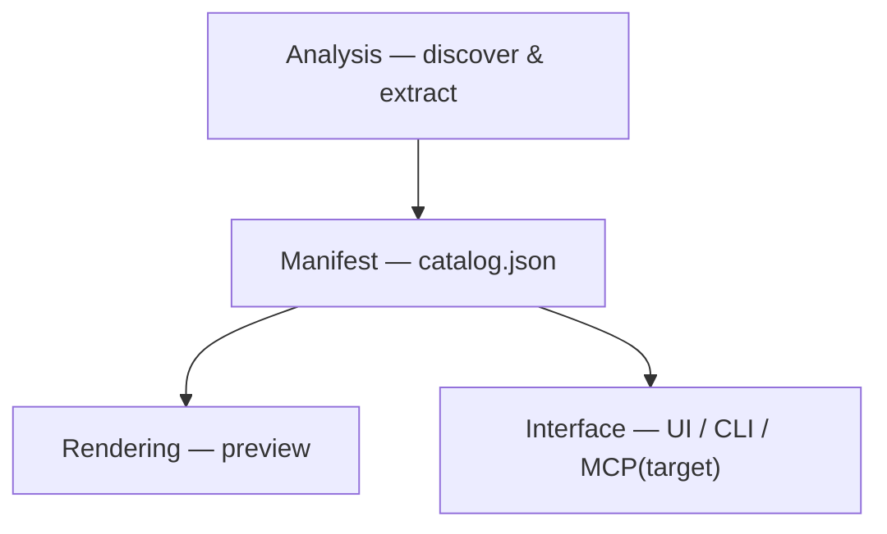
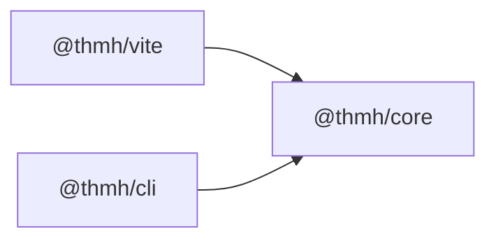
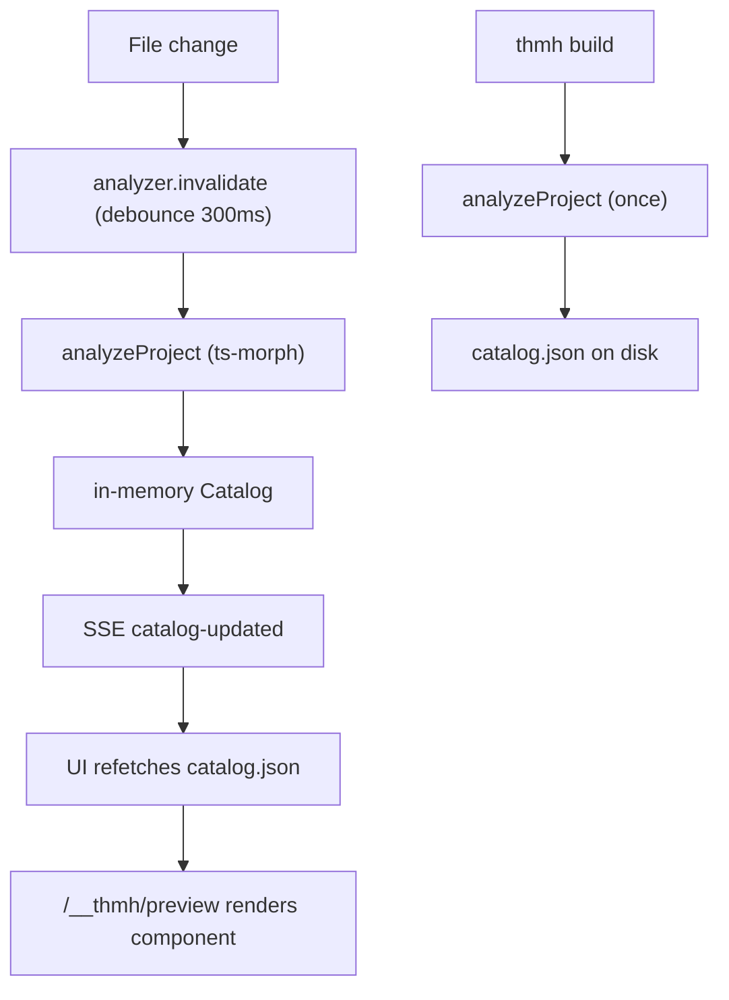

# Architecture

How thmh is structured. This document describes the **current** architecture as implemented, and points out where it is heading (marked as _target_). For the What and Why, and for phase-by-phase scope, see [requirements.md](requirements.md); for terms, see its Glossary.

## Overview

thmh turns component source into a single manifest, and derives every audience's view from it. Static analysis reads TypeScript components and their variant definitions and produces `catalog.json`; the human catalog UI, the (planned) agent-facing MCP server, and (planned) CI checks all read that one manifest rather than a hand-maintained duplicate.

## The four layers

thmh is organized into four layers. Analysis and Manifest live in `@thmh/core` (framework-independent); Rendering and Interface live in `@thmh/vite` and the CLI.

### Analysis

Statically parses TypeScript sources to enumerate components and their variants. `discover.ts` finds exported PascalCase declarations that have call signatures. `adapters/react.ts` extracts each prop (name, type, required, default, description) and the component's JSDoc description via the ts-morph type checker, dropping members declared only in `node_modules`. `adapters/cva.ts` parses `cva()` calls into base, variants, default variants, and compound variants. `assemble.ts` ties these together per file, and `index.ts` (`analyzeProject`) drives the whole pass and returns a `Catalog` (default include: `src/**/*.tsx`).

### Manifest

The single source of truth, defined in `packages/core/src/types.ts`. `Catalog` holds `schemaVersion`, `generator`, `generatedAt`, `components`, and `warnings`. Each `ComponentDoc` (id `filePath#Name`) carries its props and any `cva` metadata; `PropDoc` records whether a prop is `declared` or synthesized from cva (`source: "cva"`). `matrix.ts` derives variant axes and their Cartesian product for the variant matrix. The manifest is built in memory and either served (dev) or written to disk (build).

### Rendering

Currently client-side React-in-iframe; it does not use Playwright yet (_target_). `preview.ts` generates a virtual entry that reads `file`/`export`/`props` from the query string, dynamically imports the component, and renders it with React DOM. `client/ui.ts` is a vanilla-DOM page that renders the variant matrix as a grid of preview iframes plus a props table.

### Interface

How humans and tools reach the manifest. `packages/vite/src/index.ts` is a `serve`-only Vite plugin that watches `.ts`/`.tsx` files; `analyzer.ts` holds the in-memory `Catalog` and re-runs analysis on change (a 300 ms debounced full re-analysis today; true file-level incremental is a _target_). `middleware.ts` serves `/__thmh/` (the UI), `/__thmh/api/catalog.json`, `/__thmh/api/events` (SSE live reload), and `/__thmh/preview`. `packages/thmh/src/cli.ts` provides `thmh build`. The agent-facing MCP server and CI checks are _target_.

## Packages and dependencies

- **`@thmh/core`** — the Analysis and Manifest layers. Framework-independent; depends on `ts-morph` and `tinyglobby`. Entry point `analyzeProject`.
- **`@thmh/vite`** — the Vite plugin (Rendering and Interface for dev): middleware, catalog UI, preview, and dev-time analysis. Depends on `@thmh/core`; `vite` is a peer dependency.
- **`@thmh/cli`** — the `thmh` command (the package lives in `packages/thmh` and is named `@thmh/cli`, but the installed bin is `thmh`). Today only `build` is implemented. Depends on `@thmh/core`.

## Data flow

**Dev-time.** A watched `.ts`/`.tsx` file changes → `analyzer` invalidates and, after a 300 ms debounce, re-runs `analyzeProject` → the in-memory `Catalog` updates → an SSE `catalog-updated` event reaches the UI → the UI refetches `/__thmh/api/catalog.json` and re-renders → each cell loads `/__thmh/preview?file=…&export=…&props=…`, which imports and renders the component.

**Build-time.** `thmh build` runs `analyzeProject` once (no watcher) and writes `catalog.json`.

## Adapters: current wiring and target registry

**Current.** There is no adapter registry. `packages/core/src/assemble.ts` imports the React and cva adapters directly and calls them in sequence: it extracts props with the React adapter, finds an associated `cva()` call by matching `typeof <name>` in the component's first-parameter type (falling back to the sole cva when a file has exactly one component and one cva), and merges the results. `AnalyzeOptions` has no `adapters` field, and there is no Token (Tailwind) adapter.

**Target.** A pluggable architecture with three adapter families behind a registry:

- **Framework** adapter (today React) — extracts props and type signatures.
- **Variant** adapter (today cva) — extracts variant definitions and the matrix.
- **Token** adapter (Tailwind) — extracts design tokens and a component-to-token dependency graph.

First-party adapters are bundled and auto-enabled for common setups (they work out of the box), with explicit registration through `thmh()` options and `AnalyzeOptions.adapters` for overrides and third-party adapters (no separate config file). `assemble.ts` becomes a dispatcher over the registered adapters, and the fragile `typeof` association is replaced.

## Toward the target architecture

The structural changes ahead, so the shape of the work is legible. Phasing and acceptance live in the [requirements.md](requirements.md) roadmap.

- **Beta.** Introduce the adapter registry (refactor `assemble.ts` into a dispatcher; add `AnalyzeOptions.adapters` and `thmh()` options). Add the Tailwind **Token** adapter, which adds token fields to `ComponentDoc` and bumps `schemaVersion` (with a published JSON Schema). Add an **MCP server** to the Interface layer at `/__thmh/mcp`, exposing `search_components` and `get_component_detail` over the in-memory `Catalog`. Add `thmh init`.
- **GA.** Merge `defineCatalog` overrides in the Analysis/Manifest layers; add CI structural diff; catalog Next.js projects through the standalone path.
- **Future.** Replace/augment the client iframe Rendering with Playwright (screenshots, visual regression, interaction tests); decouple React and cva from the core so additional Framework/Variant adapters (Vue/Svelte, tailwind-variants/panda) can be added; grow the publish ecosystem.

## Key design decisions

- **Co-located with the app's Vite dev server.** Running inside the host dev server inherits its aliases, CSS, and environment, so there is no second build config to keep in sync.
- **TypeScript via ts-morph.** Resolving types such as `ComponentProps<typeof Button>` needs the type checker, not syntactic parsing; ts-morph uses the stable TS 6.0 API.
- **Story-less analysis.** Variants are derived from code (cva, prop types), so no Story files are hand-written or kept in sync.
- **One manifest as the source of truth.** `catalog.json` feeds the UI, the MCP server, and CI, so no view maintains a separate copy of a component's truth.
- **Agent-agnostic.** Agent guidance lives in `AGENTS.md` and `docs/`, and the manifest schema is open, so any MCP-compatible tool can consume a catalog.
