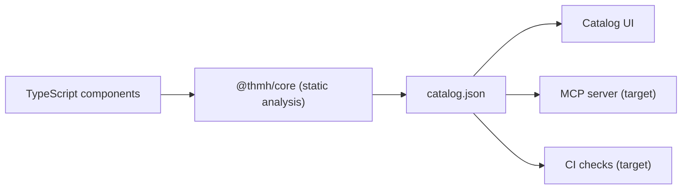
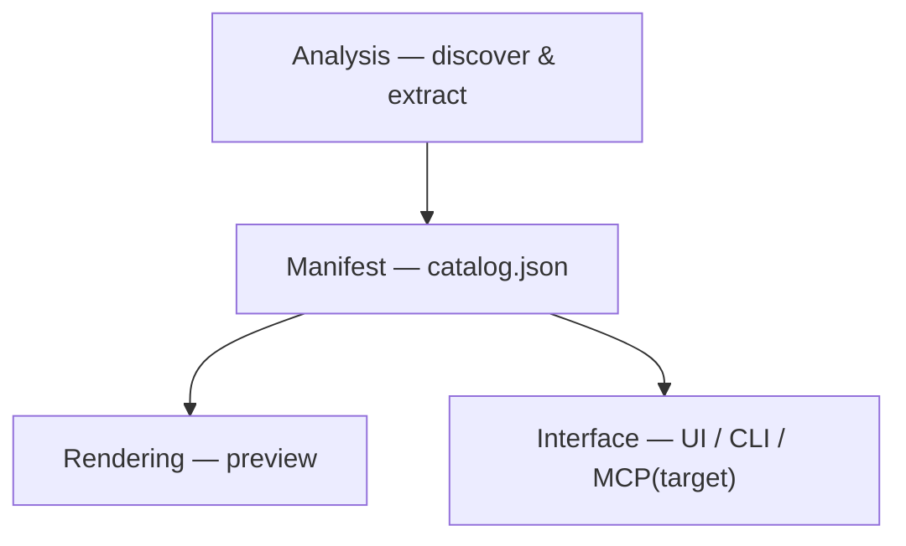
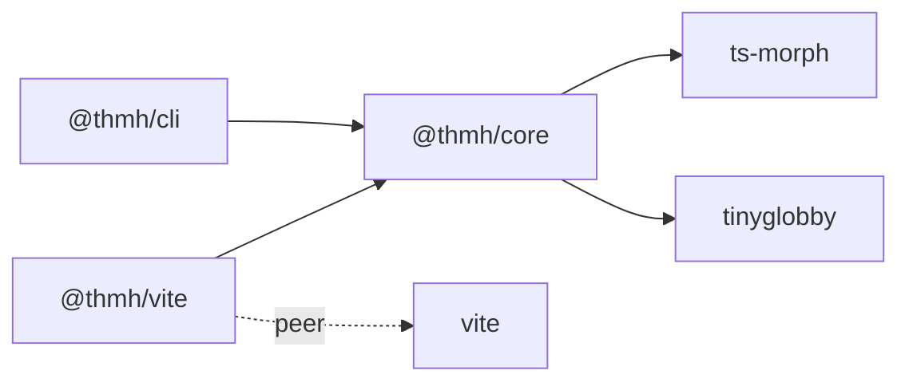
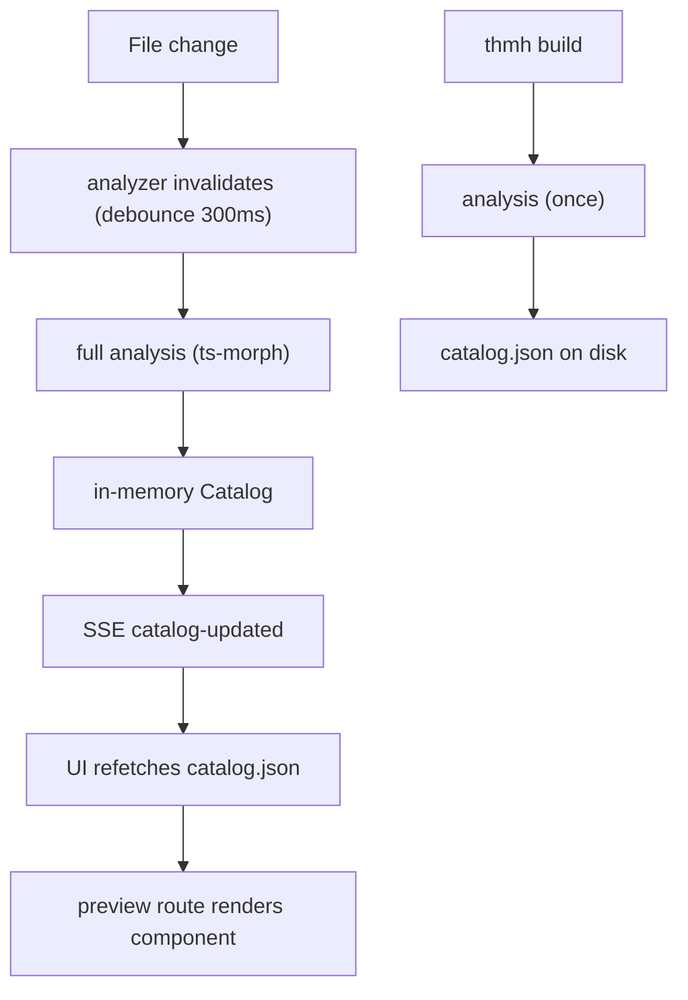

# Architecture

How thmh is structured. This document describes the **current** architecture as implemented, and points out where it is heading (marked as _target_). For the What and Why, and for phase-by-phase scope, see [requirements.md](requirements.md); for terms, see its Glossary.

It stays at the level of layers, packages, and their relationships, so it does not drift as individual files change. For the modules themselves, read the code.

## Overview

thmh turns component source into a single manifest, and derives every audience's view from it. Static analysis reads TypeScript components and their variant definitions and produces `catalog.json`; the human catalog UI, the (planned) agent-facing MCP server, and (planned) CI checks all read that one manifest rather than a hand-maintained duplicate.

## The four layers

thmh is organized into four layers. Analysis and Manifest live in `@thmh/core` (framework-independent); Rendering and Interface live in `@thmh/vite` and the CLI.

- **Analysis** — statically parses TypeScript sources to enumerate components and their variants. Framework and variant adapters do the extraction; the pass is framework-independent.
- **Manifest** — the single source of truth: the `Catalog` schema, built in memory and either served (dev) or written to disk (build).
- **Rendering** — currently client-side React-in-iframe preview; no Playwright yet (_target_).
- **Interface** — how humans and tools reach the manifest: the dev-server UI and API, the CLI's static output, and the (_target_) MCP server and CI checks.

## Packages

- **`@thmh/core`** — the analysis pipeline and the manifest schema, independent of any framework or host. It discovers components, runs adapters to extract props and variants, and assembles the manifest. Analysis adapters live under an `adapters/` directory, the extension point that today holds the React and cva adapters.
- **`@thmh/vite`** — the Vite plugin for development. It watches sources, keeps the manifest in memory, and serves the catalog UI, its JSON and SSE API, and component previews under `/__thmh/`.
- **`@thmh/cli`** — the `thmh` command (the package is named `@thmh/cli` but installs the `thmh` bin). Today it generates a static `catalog.json` via `build`.

`@thmh/core` is the foundation: it depends only on `ts-morph` and `tinyglobby`, and nothing depends inward on `@thmh/vite` or the CLI. Keeping analysis independent of any host or dev server is what lets the CLI generate a manifest without Vite while the plugin embeds the same analysis in a running dev server.

## Data flow

**Dev-time.** A watched `.ts`/`.tsx` file changes → the analyzer invalidates and, after a 300 ms debounce, re-runs a full analysis → the in-memory `Catalog` updates → an SSE `catalog-updated` event reaches the UI → the UI refetches `catalog.json` and re-renders → each cell loads the preview route, which imports and renders the component.

**Build-time.** `thmh build` runs the analysis once (no watcher) and writes `catalog.json`.

## Adapters: current wiring and target registry

**Current.** There is no adapter registry. The analysis pass wires the React and cva adapters directly: it extracts props with the React adapter, associates a `cva()` call by matching `typeof <name>` in the component's first-parameter type, and merges the results. The manifest schema has no place for design tokens, and there is no Tailwind adapter.

**Target.** A pluggable architecture with three adapter families behind a registry:

- **Framework** adapter (today React) — extracts props and type signatures.
- **Variant** adapter (today cva) — extracts variant definitions and the matrix.
- **Token** adapter (Tailwind) — extracts design tokens and a component-to-token dependency graph.

First-party adapters are bundled and auto-enabled for common setups (they work out of the box), with explicit registration through `thmh()` options and `AnalyzeOptions.adapters` for overrides and third-party adapters (no separate config file). The assembly step becomes a dispatcher over the registered adapters, and the fragile `typeof` association is replaced.

## Toward the target architecture

The structural changes ahead, so the shape of the work is legible. Phasing and acceptance live in the [requirements.md](requirements.md) roadmap.

- **Beta.** Introduce the adapter registry (the assembly step becomes a dispatcher; add `AnalyzeOptions.adapters` and `thmh()` options). Add the Tailwind **Token** adapter, which adds token fields to the manifest and bumps `schemaVersion` (with a published JSON Schema). Add an **MCP server** to the Interface layer at `/__thmh/mcp`, exposing `search_components` and `get_component_detail` over the in-memory `Catalog`. Add `thmh init`.
- **GA.** Merge `defineCatalog` overrides in the Analysis and Manifest layers; add CI structural diff; catalog Next.js projects through the standalone path.
- **Future.** Replace or augment the client iframe Rendering with Playwright (screenshots, visual regression, interaction tests); decouple React and cva from the core so additional Framework and Variant adapters (Vue/Svelte, tailwind-variants/panda) can be added; grow the publish ecosystem.

## Key design decisions

- **Co-located with the app's Vite dev server.** Running inside the host dev server inherits its aliases, CSS, and environment, so there is no second build config to keep in sync.
- **TypeScript via ts-morph.** Resolving types such as `ComponentProps<typeof Button>` needs the type checker, not syntactic parsing; ts-morph uses the stable TS 6.0 API.
- **Story-less analysis.** Variants are derived from code (cva, prop types), so no Story files are hand-written or kept in sync.
- **One manifest as the source of truth.** `catalog.json` feeds the UI, the MCP server, and CI, so no view maintains a separate copy of a component's truth.
- **Agent-agnostic.** Agent guidance lives in `AGENTS.md` and `docs/`, and the manifest schema is open, so any MCP-compatible tool can consume a catalog.
