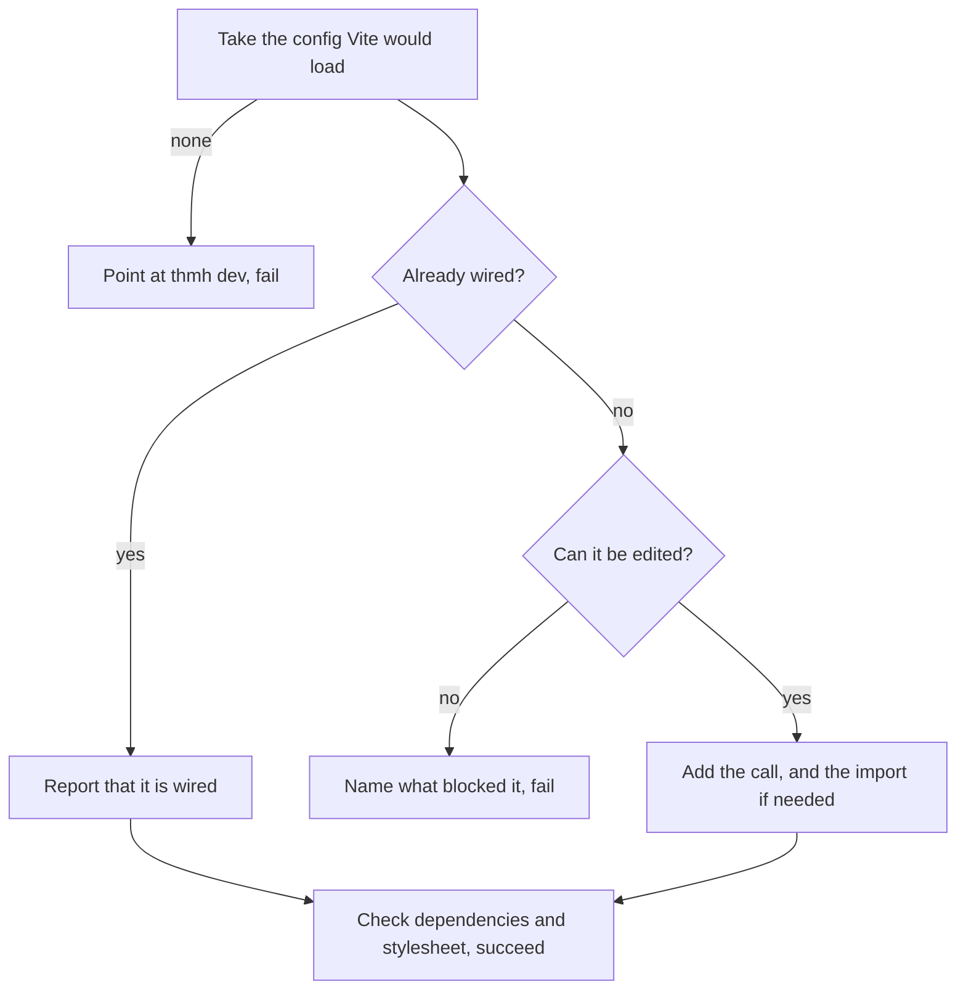

# init command

## Overview

`thmh init` adds the Vite plugin to a project that already has a Vite config, and reports what it could not do rather than guessing. It is the one command that writes to a file the user owns, which is why most of its design is about when to refuse.

## Requirements

Satisfies, from [cli](../requirements.md#cli):

> `thmh init`: wire the plugin and register the MCP endpoint. _(Beta)_

Only the first half is designed here. Registering the MCP endpoint needs a server to register; see Notes.

## Design

**The root is `--root`**, defaulting to the working directory and resolved to an absolute path, as in [CLI001](CLI001_build-command.md). Options are parsed by the same strict parser, and errors are reported the same way: `thmh: ` and the message on stderr, with a failing exit status.

**The config is the one Vite would load.** Vite looks for `vite.config` with the extensions `.js`, `.mjs`, `.ts`, `.cjs`, `.mts`, `.cts`, in that order, directly under the root, and takes the first that exists. This command applies the same rule, so the file it edits is the file that runs. Several candidates are therefore not an ambiguity to refuse: Vite resolves them deterministically and so does this. The chosen file is named in the output, because a project with more than one candidate has a reader who should know which was touched.

The search does not descend. A `vite.config.ts` in a subdirectory of a monorepo belongs to a different project, and `--root` is how that project is named.

Finding no candidate is a failure that names `thmh dev` as the command for a repository with no host app.

**The config is parsed with ts-morph**, a direct dependency of this package. It is the parser [INT002](../integration/INT002_typescript-project-resolution.md) already uses for analysis, but it does not arrive through `@thmh/core`: that package does not re-export it, and pnpm does not make a transitive dependency importable. The project is configured to accept JavaScript, since three of the six candidate extensions are not TypeScript.

**Wiring is detected by binding, not by name.** A config counts as wired when it has a default import from `@thmh/vite` and the local name that import introduces is called inside the `plugins` array. Matching the text `thmh(` instead would both miss `import catalog from "@thmh/vite"` followed by `catalog()`, and falsely match an unrelated function that happens to be named `thmh`.

A default import with no corresponding call is not wired. In that case the existing binding is reused — the call added is a call to whatever name that import already introduced — and no second import is written. Only a config with no import from `@thmh/vite` at all reaches the naming rule below; an import in any other form is refused before this point, by the first of the three checks that follow.

**Running twice changes nothing.** A config already wired is reported and left alone, and the command succeeds. Idempotence is what makes it safe to put in a setup script.

**Editing is limited to a shape it can recognize.** The default export must be an object literal, or a call to `defineConfig` with one. Then:

- a `plugins` property whose value is an array literal receives `thmh()` at the end;
- no `plugins` property at all gets one, `plugins: [thmh()]`, since a config without plugins is the ordinary minimal config rather than an obstacle;
- a `plugins` property that is anything else — a variable, a spread, a call — is refused.

A created `plugins` property is appended as the last property of the object literal, for the same reason the call is appended last: adding at the end is the edit least likely to disturb what a reader already knows about the file.

A new import is placed after the last existing import declaration, or at the top of the file when there are none. Its local name is `thmh`, unless that name is already bound at module scope, in which case it is `thmhPlugin`. A name counts as bound whether it names a value or a type: a default import introduces both, so an `interface thmh {}` in a TypeScript config collides just as a `const` would.

**Three things are refused. They are checked in a fixed order, and the first that fails is the one reported.** All exit non-zero, because the job the command was asked to do did not get done and a script that runs it should be able to tell.

1. **An import from `@thmh/vite` that is not a default import.** The package exports the factory as its default, so what the call should look like in that file is not this command's to decide. The output names the existing import. This is checked first because it decides what the other two can say: a file whose import is the wrong form has no advice worth printing about names or calls.
2. **A shape the editor does not cover** — a config assembled by a function, a conditional export, or a `plugins` value that is a variable, a spread, or a call. The output prints the edits a person would make by hand: the call, and the import line only when the file has no import from `@thmh/vite`. A file that already imports the plugin is not told to import it again. When the file has no import and no free name for one, neither line is printed and the output names the two taken identifiers instead — with no name to write, the call is as unprintable as the import.
3. **Both `thmh` and `thmhPlugin` already bound.** The output names the two identifiers and says the import needs a name the file has not taken. It prints no import line, because there is no correct one to print.

The order is what makes the outputs decidable when more than one applies. It also makes the third refusal unreachable from a config whose shape is unsupported, which is correct: a file that cannot be edited does not need a name chosen for it.

Refusing rather than attempting is the shape of this command. A wrong edit to a config file is worse than no edit: it breaks a project that was working, in a file the user wrote, and the failure surfaces at the next `vite` run rather than here.

**Only the edited nodes are reprinted.** The rest of the file keeps its formatting, and no formatter is run over it — a project's own formatter owns that.

**Dependencies are reported, never installed.** `@thmh/vite` is a dependency of this package, so its `peerDependencies` are read from the copy that ships with the command. Reading the target's copy would fail in the case most worth reporting, which is the target not having installed it at all.

Each peer the target's `package.json` declares in neither `dependencies` nor `devDependencies` is reported, along with `@thmh/vite` itself when it is absent from both. A peer the plugin marks optional in `peerDependenciesMeta` is not reported, since the plugin has said it can do without it. Reading the plugin's declaration rather than listing packages here keeps the knowledge of what the plugin needs in one place: when the plugin stops requiring React, or marks a peer optional, this command follows without being changed.

Satisfaction is by name. A declared dependency passes whatever range it names, because a range conflict is what `npm install` reports, at a moment when the user has actually installed something. The range the plugin asks for still appears in the report, since that is what the reader needs in order to install the right thing.

**Neither a missing dependency nor a missing stylesheet fails the command.** Both are reported on stderr and the exit status stays zero. The wiring succeeded, and installing is the user's next step; a setup script that runs `init` before installing is the ordinary order, not an error.

**One line goes to stdout on success**: what happened to which file, either that the plugin was added to it or that it was already wired. Everything the user should act on — a dependency to install, a stylesheet that is not there — goes to stderr, so that a script can separate what changed from what remains to be done.

**The stylesheet is checked, not created.** The plugin's `css` option is a server-root-relative URL path, so the default `/src/index.css` is checked on disk at that path under the root with its leading slash removed. When the config was already wired and passes a string literal for `css`, that path is checked instead; when it passes anything else, the check is skipped and the command says so. [UIX001](../ui/UIX001_preview-sandbox.md) degrades to a hint inside the frame rather than failing, which is why this is a report and not an error.

## Notes

**Registering the MCP endpoint is not designed yet.** The requirement names it, and it needs two things that do not exist: the MCP server, and the command that runs it. What gets written also depends on which transport the server offers, since a stdio endpoint is registered as a command to spawn and an HTTP one as a URL. This document is updated when both are designed, rather than guessing a format now.

**A recognizable shape is a smaller set than a valid config.** The rule above refuses configs a person would find obvious, `plugins: [...basePlugins, react()]` among them. Widening it means either evaluating the config, which turns a text edit into running the user's code, or growing a list of shapes, which never ends. The refusal path exists so that widening stays optional.

**A declared dependency is not an installed one.** The check reads `package.json` and not `node_modules`, so a project that declares `@thmh/vite` and never installed it passes. Reading `node_modules` instead would be more truthful and less portable, since what is reachable there depends on the package manager and its linking mode.

**Nothing verifies that the edit worked.** The command writes the file and does not re-parse it or run Vite against it. A malformed result surfaces at the next `vite` run rather than here.
