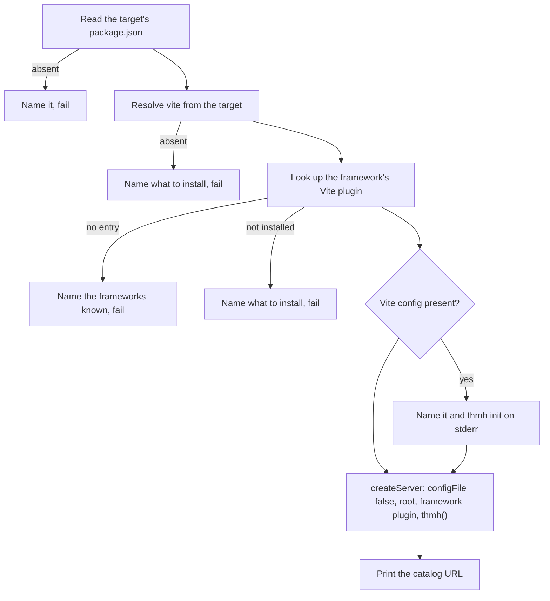

# dev command

## Overview

`thmh dev` serves the catalog for a repository that has no host app, by building the Vite server such a repository would have had. It is the path for a component library or a design system that ships components and never runs them.

## Requirements

Satisfies, from [cli](../requirements.md#cli):

> `thmh dev`: run a standalone catalog server for repositories with no host app. _(Beta)_

## Design

**Options.** `--root` names the directory to serve, defaulting to the working directory and resolved to an absolute path, as in [CLI001](CLI001_build-command.md). `--port` is passed to Vite when given and otherwise left unset, so Vite's own default applies and Vite moves to another port when it is taken. `--include` and `--css` are passed to the plugin only when given, so the plugin's defaults stay in one place. Parsing and error reporting follow CLI001.

**Everything the host would have supplied is resolved from the target, not bundled.** `vite` and the framework's plugin are loaded out of the target root's `node_modules`. This command depends on neither, so the version that runs is the version the repository chose, and a repository pinned to a particular Vite never has a second one imposed on it.

**The plugin itself travels with the command.** `@thmh/vite` is a dependency of this package. That is safe because it imports nothing from `vite` at runtime — all three of its `vite` references are `import type` — and the React imports in the preview live inside a string of generated browser code rather than in the module graph.

**The framework's plugin is looked up, not named.** The target's `dependencies`, `devDependencies`, and `peerDependencies` are all read, because a component library commonly declares its framework as a peer rather than a dependency. What is found decides which Vite plugin is loaded:

| The target declares | The plugin loaded |
| --- | --- |
| `react` | `@vitejs/plugin-react`, falling back to `@vitejs/plugin-react-swc` when only that one is installed |

When both are installed, `@vitejs/plugin-react` is used; it is the reference implementation, and preferring it makes the choice reproducible rather than dependent on resolution order. A framework with no row produces an error naming the frameworks that have one, rather than a server whose every preview fails at module load.

This table is the wrong long-term home for the mapping. A framework adapter already has to know how its components are written, and which Vite plugin transforms them belongs with it. When the adapter registry (ANA006) exists, the lookup moves there and this command asks the registry instead. It is written here now because the registry does not exist yet, and written as a lookup so that moving it is a change of location rather than of shape.

**Why a framework plugin is required at all**: [UIX001](../ui/UIX001_preview-sandbox.md) renders each preview through the host's index-HTML transform, because React's Fast Refresh plugin injects a preamble there without which the component module throws on load. The same plugin is what compiles the target's JSX. A server without it serves previews that fail.

The plugin's position in the array does not affect this. [INT001](../integration/INT001_vite-plugin.md) registers no `transformIndexHtml` hook of its own; its middleware calls `server.transformIndexHtml` when it serves a preview, and that runs every plugin's hook whatever the order. So the array below is written in the order a host would write it, and nothing depends on it.

**The server is created with `configFile` set to false**, the resolved root, and the plugins `[framework, thmh()]`. Disabling config loading is what makes the claim below true: left unset, Vite would find and load a `vite.config` under the root, and the target's own plugins would be applied on top of a framework plugin this command had already added.

**A target that has a Vite config is told that it is being ignored.** The command finds it by the rule [CLI002](CLI002_init-command.md) states, and names that file on stderr along with `thmh init` as the way to use it instead. It then serves anyway: the request was to serve, and refusing would help nobody.

**One line goes to stdout on success**: the server's URL with `__thmh/` appended, read after it is listening, since Vite has resolved no URLs before then. The first local URL is used, falling back to the first network URL when Vite resolved no local one, which is the same order Vite's own startup output uses. Reading what Vite resolved rather than assembling the URL from the port is what makes the printed address one the server is actually listening on.

**`SIGINT` and `SIGTERM` close the server, wait for the close to finish, and exit zero.** An interrupted `dev` is a `dev` that did its job, not a failure. Waiting matters because what `server.close()` does not release is already a known gap; exiting before it finishes would add a second one.

## Notes

**A repository whose imports rely on path aliases is not served correctly yet.** Aliases normally reach Vite through the host's config, and a repository with no host app has none, so an import through `@/…` fails to resolve and the component's preview shows the error.

The route to fixing this is not open-ended. [INT002](../integration/INT002_typescript-project-resolution.md) already resolves the target's tsconfig for analysis, and a tsconfig's `paths` is the same information Vite wants in `resolve.alias`. Translating one into the other covers the common case. What needs designing is the translation itself: `baseUrl`-relative resolution, the wildcard forms `paths` allows, and what to do when one pattern maps to several locations. That is why this is recorded rather than done here.

**No Vite configuration is inherited, by construction.** Aliases are called out above because they are the case that bites, but `configFile: false` means PostCSS settings, `define` values, and custom `resolve.conditions` are all absent too. A repository needing any of them is a repository that should keep a Vite config and use [CLI002](CLI002_init-command.md) instead. The dividing line is whether the repository has a host app at all.

**Depending on `@thmh/vite` leaves its peer dependencies unmet in this package.** It declares `vite`, `react`, and `react-dom` as peers, and this package satisfies none of them; installing the CLI alone therefore warns. Nothing imports them at runtime, so for this package the warning describes no defect.

It is not something to silence from here. [INT001](../integration/INT001_vite-plugin.md) states that those peers are real requirements of a host, and that making them optional waits on a rendering adapter that admits other frameworks. The warning is the cost of this command depending on a package whose requirements it does not itself satisfy, and it stands until that adapter exists.

**A long-lived server accumulates analyzers.** INT001 releases neither the watcher subscription nor the debounce timer when a server closes. One `thmh dev` process serving one server never notices; a process that restarts servers does.

**Whether `dev` should serve a target with no framework at all** is left open. A catalog of components that never render is arguably useless, and failing with a message naming the known frameworks is the current answer.
