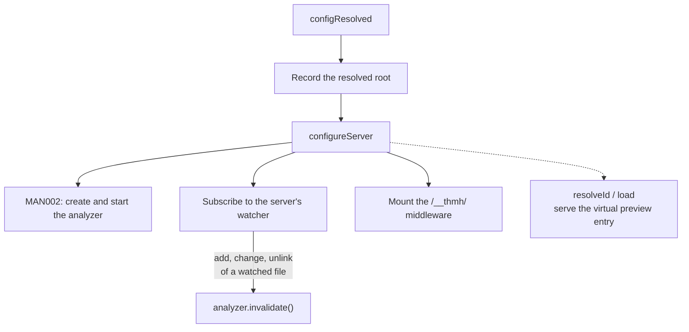

# Vite plugin

## Overview

The one thing a consumer installs. It attaches thmh to an existing Vite dev server, so the catalog inherits the app's own aliases, CSS pipeline, and environment instead of asking for a second build configuration.

## Requirements

Satisfies, from [integration](../requirements.md#integration):

> Run as a Vite plugin inheriting the host app's config (aliases, CSS, environment). _(Prototype)_

## Design

The plugin is a factory taking two options and returning a Vite plugin object. `include` overrides which files are analyzed; `css` names the stylesheet the preview loads, defaulting to `/src/index.css`.

It applies only to `serve`. Under `vite build` it is inert: no hook runs, and nothing is emitted.

**The root comes from the resolved config**, not from the process. The field is initialized to the current working directory, but Vite resolves configuration before it creates the server, so `configResolved` always supplies the real root before anything reads it. Running the dev server from a directory other than the project root still produces paths relative to the project root.

**The watcher is the server's own**, subscribed through its `all` event rather than through `handleHotUpdate`. Only `add`, `change`, and `unlink` count. A file qualifies when its name ends in `.ts` or `.tsx` and no segment of its path is `node_modules`, `dist`, or `.git`. Every qualifying event calls `invalidate`, and the debouncing is [MAN002](../manifest/MAN002_dev-manifest-refresh.md)'s concern, not this one's.

**The preview entry is a virtual module.** `resolveId` claims one well-known id and `load` returns generated source for it, closing over the configured `css` path. Because the module goes through Vite, the preview gets the host's transforms — including the React Refresh preamble the middleware injects.

## Notes

**Nothing is torn down when the server closes.** The watcher subscription is never removed and a pending debounce timer is never cleared. In a long-lived process that restarts servers, such as a test run, analyzers accumulate.

**The default `include` lives somewhere else.** Leaving the option unset passes `undefined` through to analysis, which applies its own default of `src/**/*.tsx`. So the plugin's documented default is not written in the plugin, and a reader has to follow the value into `@thmh/core` to learn what it is.

**Exclusion is by path segment, so it over-matches.** A directory legitimately named `dist` inside `src` is skipped along with build output. The rule cannot tell a project's source directory from a build artifact of the same name.

**The `css` default is a convention, not a discovery.** A project whose stylesheet is not at `/src/index.css` gets a preview that fails to load it until the option is set. Nothing inspects the project to find out.

**The preview needs React, and nothing says so.** The generated entry imports `react` and `react-dom/client` unconditionally, while the package declares only `vite` as a peer dependency. The requirement on the host is real and undeclared: a project without React installed gets a preview that fails to resolve its imports, with no signal at install time. Declaring the peer would state the constraint, at the cost of admitting a framework dependency in a package whose analysis half is meant to be framework-independent — which is the same tension ANA006 addresses on the analysis side.

**Watching is broader than the module graph.** Using the raw watcher means edits to files Vite never loaded still trigger analysis, which is what makes a component in an unimported file appear in the catalog. It also means edits to unrelated `.ts` files cost a full re-analysis.

**Build-time output is out of scope here.** Because the plugin is serve-only, the only way to get a static `catalog.json` is the CLI, described by CLI001.

**Two dependency edges are not yet declared.** This plugin mounts the catalog's HTTP routes and serves the preview entry, which UIX001 and the ui domain's page documents will describe. Those documents do not exist, and declaring an edge whose inverse cannot be written would leave the graph one-directional. The ui domain adds them in both directions when they are written.
