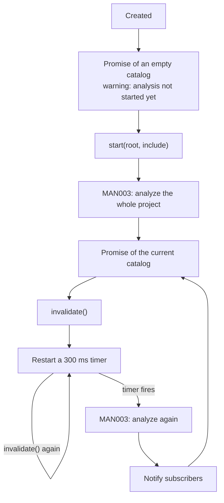

# Dev-time manifest refresh

## Overview

Holds one catalog in memory while the dev server runs, re-derives it when sources change, and tells subscribers when a new one is ready. It is what makes the catalog follow the code without a rebuild.

## Requirements

Satisfies, from [manifest](../requirements.md#manifest):

> Re-derive the manifest on file change during development. _(Prototype; incremental, file-level analysis targeted for Beta)_

## Design

The state is a promise of a catalog rather than a catalog. A request that arrives mid-analysis awaits the run in flight instead of racing it or triggering a second one.

**Before `start`**, the promise resolves to an empty catalog carrying the warning that analysis has not begun. A consumer that asks early gets a well-formed catalog rather than an error or a hang.

**`invalidate` debounces.** Each call clears the pending timer and starts a new 300 ms one, so a burst of file events produces one analysis. The timer is what is debounced, not the analysis: once it fires, that run is not cancelled by further calls.

**Subscribers are notified after the new catalog resolves**, never before. A subscriber woken by the notification and reading the promise gets the fresh catalog, not the one it replaced.

**A failed analysis does not propagate.** The error is logged through the Vite logger and converted into an empty catalog whose warnings carry the message. The dev server keeps serving, and the failure is visible in the catalog itself rather than only in the terminal.

## Notes

**Every refresh re-analyzes the whole project.** Nothing is reused between runs, and the cost grows with the size of the codebase rather than with the size of the edit. This is the performance requirement beta names, and MAN004 is where it is addressed.

**The catalog is stale for the length of the debounce.** During those 300 ms the promise still resolves to the previous catalog, and nothing marks it as out of date. A consumer cannot tell "current" from "about to be replaced".

**Errors reach the catalog but replace it.** Because a failure produces an *empty* catalog, one bad edit anywhere makes every component disappear from the UI until the next successful analysis. Keeping the last good catalog and attaching the error to it would fail more softly, at the cost of showing records that no longer match the source.

**`invalidate` before `start` analyzes nothing useful.** The root is the empty string until `start` supplies one, so a timer that fires first runs an analysis against `""`. Nothing in the current plugin ordering makes this happen, and nothing prevents it either.

**The generator string for these empty catalogs is `@thmh/vite`, without a version**, which does not match the format `@thmh/core` writes. See [MAN001](MAN001_catalog-schema.md).
