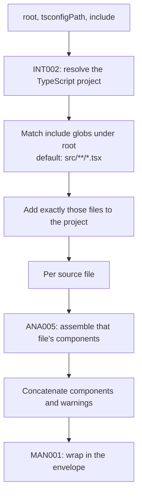

# Catalog generation

## Overview

Turns a project directory into one catalog. It is the single entry point into analysis: the CLI calls it to write `catalog.json`, and the dev server calls it to hold one in memory.

## Requirements

Satisfies, from [manifest](../requirements.md#manifest):

> Produce a `catalog.json` capturing components, props, variants, defaults, and dependencies. _(Prototype)_

## Design

The input is a root directory, an optional tsconfig path, and an optional list of globs. The output is a catalog.

Only the files matched by the globs are analyzed. Resolving types pulls declarations from elsewhere into the compiler's view, but those files are never added to the project, so the analysis loop never walks into `node_modules` or into a dependency's sources. The default `src/**/*.tsx` therefore means what it says.

Components and warnings from every file are concatenated in the order the project reports its source files. Nothing deduplicates, sorts, or reconciles across files: two components with the same name in different files are two records, distinguished by their ids.

The whole project is analyzed on every call. There is no incremental path and no cache.

## Notes

**`generator` is hardcoded and already wrong.** The value is the string `@thmh/core@0.0.0`, written into the source, while the package is at `0.1.0-next.0`. Every catalog produced since the first version bump has misreported what made it. The value should come from the package version rather than from a constant. It is also formatted differently from the one `@thmh/vite` writes for an empty catalog, which is `@thmh/vite` with no version at all.

**`generatedAt` makes the output differ on every run.** It is the current time, so running `thmh build` twice over unchanged sources produces two different files. That is a direct obstacle to the GA requirement to diff manifests in CI for breaking changes, since every diff is non-empty. Deriving the field from the inputs, or excluding it from comparison, is a decision for MAN005 alongside versioning.

**A failure anywhere outside a component aborts everything.** Per-component failures are contained by ANA005, but an error while creating the project or matching the globs propagates out of this function. The dev-time analyzer catches it and converts it into an empty catalog ([MAN002](MAN002_dev-manifest-refresh.md)); the CLI does not, and exits.

**The default glob only matches `.tsx`.** A component written in a `.ts` file is never discovered unless the caller overrides `include`. The dev-time file watcher, by contrast, watches both `.ts` and `.tsx`, so editing a `.ts` file triggers a re-analysis that cannot observe it.

**This stage has two callers.** The dev-time analyzer in [MAN002](MAN002_dev-manifest-refresh.md) holds its result in memory; the `thmh build` command in [CLI001](../cli/CLI001_build-command.md) writes it to disk. Neither reuses the other's work, so a project served and built in the same session is analyzed twice.
