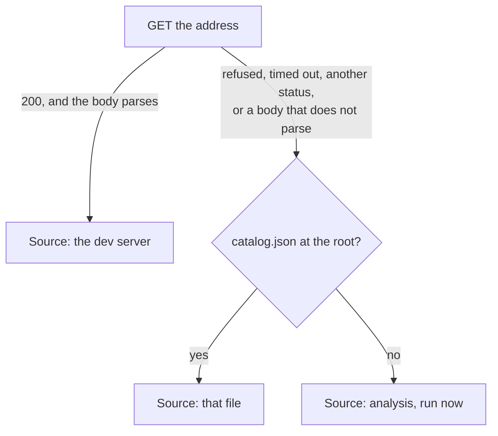

# MCP server

## Overview

The Model Context Protocol server that exposes the catalog to agents. It defines one set of tools and reaches them two ways: over Streamable HTTP where a dev server is serving the catalog, and over stdio where an agent spawns a process itself. This document covers the server, what it reads, and how it is reached; the tools it carries are MCP002 and MCP003.

## Requirements

Satisfies, from [mcp](../requirements.md#mcp):

> Expose an MCP server wherever the catalog is served, whether that is the host app's dev server or the standalone one. _(Beta)_
>
> Reach the catalog from an agent whether or not a dev server is running, so that connecting does not depend on what the developer happens to have open. _(Beta)_
>
> Answer with what the source says now, while a dev server is serving: a tool call made after an edit reflects that edit. _(Beta)_
>
> Support both Streamable HTTP and stdio transports. _(Beta)_

## Design

**A catalog source is a name and a `load`.** `load` takes no arguments and returns a promise of a [`Catalog`](../manifest/MAN001_catalog-schema.md), rejecting when it cannot produce one. The name is a short phrase for the place the catalog came from, and it exists so that a failure can say which one failed. Everything a source needs is closed over when it is built.

**The tools do not know how they were reached.** Transport and source are chosen independently by whoever builds the server, and no tool branches on either. That is what keeps two ways of reaching the catalog from becoming two implementations of it.

**`load` is called per tool call**, because the freshness requirement is a promise about what a call returns. Nothing is cached between calls at this level; a source that needs to cache does so behind its own `load`, and one of them does.

Reading is cheap for two of the sources and not for the third. The analyzer, an HTTP endpoint on localhost, and a file on disk are all read again at every call, so a catalog that changed since the last one is seen. Analysis is not in that class: running it per call would put a full pass over the project in front of every question. So the analysis source runs once, on the first call that needs it, and answers from that afterwards.

### Over HTTP

**The route is `/__thmh/mcp`**, alongside those [INT001](../integration/INT001_vite-plugin.md) already serves. The SDK's Streamable HTTP transport takes Node's own request and response objects, so this is one more case in the existing middleware rather than a second server.

**Only `POST` is answered.** The existing middleware matches on pathname alone, so this route is the first that also has to look at the method. Anything else gets `405` with a JSON-RPC error body, which is what the SDK's own stateless example does.

**Sessions are not used, and a server is built per request.** The transport runs stateless, which in this SDK means a fresh `McpServer` and transport for each request. Reusing one instance is not a trade to weigh: the SDK's protocol object refuses a second transport outright, throwing `Already connected to a transport`, so a shared instance would fail on the second concurrent request rather than queue it.

The order is: build both, register the close handler on the response, connect, then hand over the request. Registering the handler first is what makes it fire for a client that disconnects while the request is in flight.

Closing both is required rather than optional. The transport's `close` releases its connections, and skipping it in a long-lived dev server accumulates exactly what [INT001](../integration/INT001_vite-plugin.md) accumulates elsewhere.

**The source is the analyzer in this process** ([MAN002](../manifest/MAN002_dev-manifest-refresh.md)), so a tool reads the catalog the page is showing.

That satisfies the freshness requirement except while an analysis is pending, and the exception is not a fixed window. MAN002 restarts its 300 ms timer on every file event, so a run of saves holds the previous catalog for as long as the saves continue, not for 300 ms. Closing that gap means being able to tell "current" from "about to be replaced", which is MAN002's own recorded shortfall and not something this server can decide from outside.

### Over stdio

An agent that spawns a process rather than connecting to a URL gets the same tools over stdin and stdout. The ladder below belongs to this document; CLI004, which is not designed yet, only maps command-line options onto its two inputs.

**The inputs are a root and an optional dev-server address.** The root defaults to the working directory and is resolved to an absolute path, as in [CLI001](../cli/CLI001_build-command.md). The address, when absent, is `http://localhost:5173`, which is Vite's default port.

**The first rung that answers wins.**

1. **A dev server.** A `GET` to `/__thmh/api/catalog.json` at the address, taken when it returns `200` within two seconds and the body parses as a catalog.
2. **`catalog.json` at the root**, whatever `thmh build` last wrote.
3. **Analysis, run now**, the analysis [MAN003](../manifest/MAN003_catalog-generation.md) performs against the root.

**Anything but a taken rung 1 falls through**: a refused connection, a timeout, a status other than `200`, or a body that does not parse. None of them is an error, because the rungs below exist precisely so that a missing dev server is not one.

That holds even for an address the caller named. Being told which address to try is not a claim that it will answer, and failing there would make reaching the catalog depend on whether a dev server happens to be up — which is the state the requirement above rules out. What a named address earns instead is a line on stderr saying it was tried and did not answer, so its owner learns the setting is not doing what they think.

The ladder chooses where the catalog comes from, not which protocol is spoken. The agent is answered over stdio at every rung; the first rung reads the dev server's catalog rather than forwarding tool calls to it, because forwarding would mean maintaining a translation between two MCP endpoints to obtain what a JSON document already carries.

**The rung is chosen once, at startup, and not chosen again.** A dev server that stops answering later makes `load` reject, and the tool says so; the ladder does not quietly drop to the file on disk. The stderr line below announced which source was in use, and silently changing it would make that announcement false — an agent receiving stale answers where it had been receiving current ones, with nothing said, is worse off than one told its source is gone.

**The rung that answered is named on stderr at startup.** The three differ in how current they are, and whoever is watching should not have to infer which is in play. Nothing goes to stdout, which belongs to the protocol.

**Every call on the first rung is a round trip.** That is what buys the freshness the rung exists for, and on a localhost dev server it is cheap; it is worth knowing that it is not free.

**Discovery does not scan.** One default address and one override, so the behavior is predictable and the command cannot attach to an unrelated server listening on a nearby port.

### When the catalog does not arrive

Failure reaches a tool in two shapes, and they are not interchangeable.

**A source that rejects** — a file that will not read, an analysis that throws — becomes a tool result marked as an error, carrying the source's name and what failed. It is a tool result rather than a protocol-level error, because the call was well-formed and it is the work that failed. It does not become an empty catalog, because an empty catalog says the project has no components, which is a different and wrong claim.

A source's name is what that message uses to say where it was reading: the analyzer in this process, the dev server at the address tried, `catalog.json` at its path, or analysis of the root. How a tool words the rest, and where in its result the text sits, is the tool's own business.

**A catalog that arrives carrying warnings** is the other shape, and it is the one the HTTP source actually produces. MAN002 catches a failed analysis and returns an empty catalog whose `warnings` hold the message, so on that path `load` does not reject; it succeeds with nothing in it. A tool surfaces those warnings rather than dropping them, and does not mark the result an error, since the source did produce a catalog. Which field carries them is the tool's own business; that they reach the agent is not.

It cannot do better than that yet. Telling "the catalog is complete, with three notes" from "analysis failed and this is empty" needs the two kinds of entry in `warnings` to be distinguishable, which is [MAN001](../manifest/MAN001_catalog-schema.md)'s recorded shortfall. Until that lands, an agent reading this server can be told what the warnings say but not which of the two happened.

## Notes

**Authentication is not designed, and is not needed yet.** Both ways of reaching this server are local: a route on the host's own dev server, or a process the agent spawned. Whoever reaches either can already read the sources the catalog was derived from. Authentication becomes a real question when a published catalog is served to someone who cannot, which [requirements](../requirements.md#open-questions) records against OAuth.

**Tools that are unavailable rather than failing are not designed here.** A rendering tool reached over stdio with no dev server has nothing to render with, and the requirement that a tool say what to do next is aimed at that case. No Beta tool has such a mode — MCP002 and MCP003 read the catalog and nothing else — so the answer's shape is settled when the rendering tools arrive.

**What CLI002 needs from this document, it now has.** `thmh init` defers registering the MCP endpoint because there was nothing to register. A registration needs an address and a transport kind, and both are fixed here: `/__thmh/mcp` on the host's dev server, over Streamable HTTP. Designing the registration, including which agent's configuration receives it, stays [CLI002](../cli/CLI002_init-command.md)'s, and the dependency edge is written when that half is designed.

**Nothing notifies an agent that the catalog changed.** The SDK can announce a changed tool list, but the tools do not change — their answers do. An agent learns of an edit by asking again. Whether that suffices, or whether a subscription belongs here, is worth revisiting once the tools exist and it is clear how agents call them.

**The third rung answers from one analysis for the life of the process.** The first tool call in a large project with no `catalog.json` waits for a full pass, and every call after it is fast and no fresher. Nothing there watches files, so there is nothing to invalidate on; restarting the process is what refreshes it, and that is also what re-runs the ladder after a dev server has come or gone. Caching a pass across launches is MAN004's subject rather than this one's.

**The first rung trusts what answers.** A `200` that parses as a catalog is taken to be a thmh dev server. That rules out most accidents but proves nothing about which project is being served, and a wrong guess is silent: the agent gets a real catalog for the wrong repository. Naming the address explicitly is what a user has instead.
