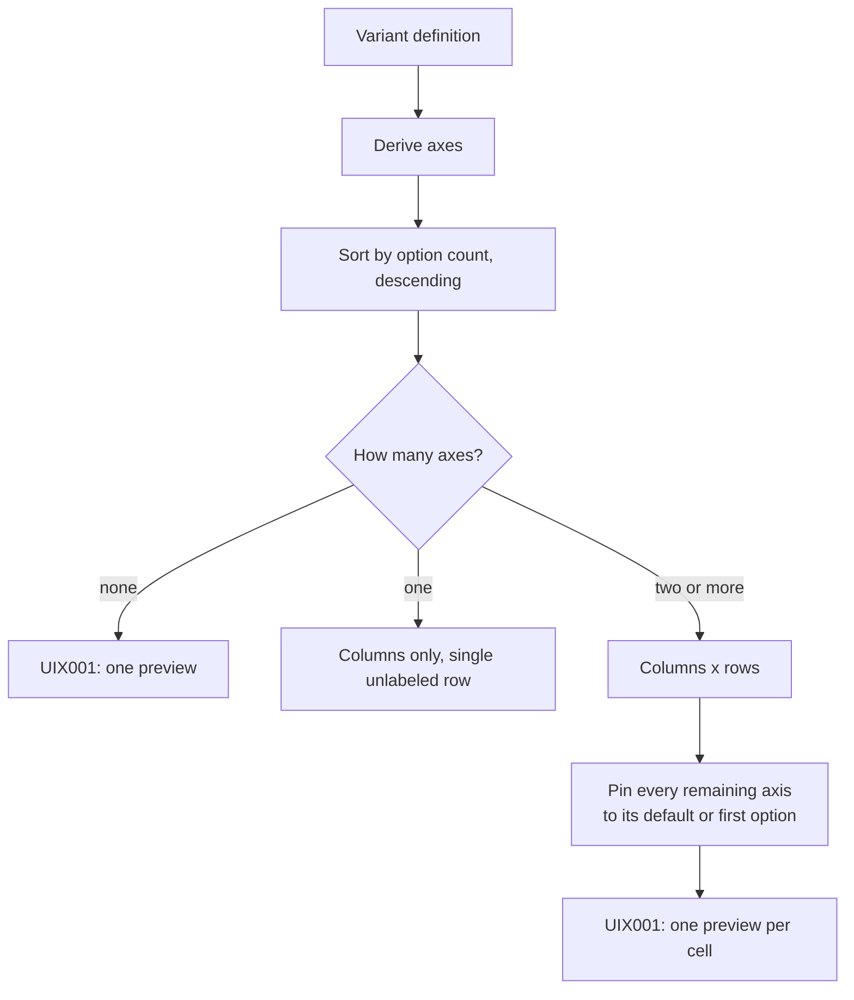

# Variant matrix grid

## Overview

The grid of previews showing a component's variants side by side. It is the answer to "what does this component actually look like", and it is what a Story file would otherwise have to enumerate by hand.

## Requirements

Satisfies, together with [UIC001](UIC001_props-table.md), from [ui](../requirements.md#ui):

> Show the variant matrix and a props table (name, type, required, default, description). _(Prototype)_

## Anatomy

A table whose columns and rows are two variant axes, with a preview iframe in every cell.

The `Button` in the example app declares `variant` with five options and `size` with three, so `variant` takes the columns:

```
┌─────────┬──────────┬───────────┬─────────────┬──────────┬──────────┐
│  size   │ default  │ secondary │ destructive │ outline  │ ghost    │
├─────────┼──────────┼───────────┼─────────────┼──────────┼──────────┤
│   sm    │ [Button] │ [Button]  │  [Button]   │ [Button] │ [Button] │
├─────────┼──────────┼───────────┼─────────────┼──────────┼──────────┤
│ default │ [Button] │ [Button]  │  [Button]   │ [Button] │ [Button] │
├─────────┼──────────┼───────────┼─────────────┼──────────┼──────────┤
│   lg    │ [Button] │ [Button]  │  [Button]   │ [Button] │ [Button] │
└─────────┴──────────┴───────────┴─────────────┴──────────┴──────────┘
    ↑          ↑
    │          └── variant: five options, so it takes the columns
    │
    └── size: three options, so it takes the rows. The corner cell
        carries its name. Any further axis is pinned to one value
        and never appears.

    Each cell is an iframe 90 px tall, rendering Button with its
    children set to the string "Button".
```

The axis names carry no meaning to thmh. `variant` and `size` are what this component's author happened to write; a component declaring `tone` and `density` produces the same grid with those names. What decides the layout is only how many options each axis has.

Axes are sorted by how many options they have, largest first. The largest becomes the columns, the second largest the rows, and every remaining axis is pinned to one value: its default, or its first option when it has no default.



The corner cell holds the row axis's name. Column headers hold the column options; row headers hold the row options. With only one axis, the row header column is present but empty.

Every cell passes the component's own name as its children, so a preview always has something to render.

## Behavior

The grid is computed once, when the page renders, and never changes. There is no way to choose which axes are shown, to change a pinned value, or to see a combination the grid does not display.

Frames load lazily, so cells outside the viewport are not fetched until scrolled to.

## A11y

**Header cells are `th`** for both the column headers and the row headers, which is the correct shape for a two-axis grid.

**Headers declare what they head.** Column headers carry `scope="col"` and row headers `scope="row"`, so association is stated rather than guessed. That matters more here than in [UIC001](UIC001_props-table.md): with headers on both axes, a reader has no reliable way to infer which direction a `th` applies to.

**The corner cell is a `th` with the row axis's name**, scoped to the column of row headers it sits above. With one axis it is an empty `th` announcing nothing.

**The table has an accessible name**, supplied by a caption naming the component whose variants it shows. The caption is visually hidden, because the component's name is already on screen in the heading directly above and repeating it would be noise for a sighted reader while remaining the only way a screen reader tells one table from another.

**Every frame names what it renders.** A cell's `title` lists the component and every variant axis the frame is rendering, so a reader navigating frames hears `Button, variant default, size sm` rather than an anonymous frame. Axes that are pinned rather than displayed appear in that list too, which is the one place a reader learns the grid is a slice of something larger.

## Design

Two axes on screen is a deliberate limit: a table is two-dimensional, and the alternative — nesting or repeating grids — costs more comprehension than it returns.

Sorting by option count puts the widest axis along the columns, which reads better left to right than top to bottom and keeps the table from becoming very tall.

Fixed-height frames keep rows aligned so the grid reads as a grid. The cost is a component that does not fit, which the Notes cover.

## Notes

**Axis derivation is duplicated here.** This grid re-implements the derivation that [ANA004](../analysis/ANA004_variant-matrix.md) already provides, rather than consuming the manifest's own. Two copies of one rule is exactly the duplication this project treats as a defect, and it is recorded against ANA004 as well. Resolving it means either recording the matrix in the manifest or having this consume the exported function.

**Frame height is a fixed 90 pixels.** A component taller than that is clipped with no scroll and no indication that anything was cut. A component much shorter sits in a mostly empty cell.

**Beyond two axes, most of the matrix is unreachable.** A component with three axes shows one slice, chosen by a rule the reader cannot see or change. The requirement calls for the full variant matrix, and what is displayed is a projection of it.

The projection is what keeps the display bounded, so the cost lands on coverage rather than on cell count. Measured against the example app's `Button` and two hypothetical axes added to it:

| Axes | Combinations | Cells shown | Coverage |
| --- | --- | --- | --- |
| `variant(5) × size(3)` | 15 | 15 | 100% |
| `+ tone(4)` | 60 | 20 | 33% |
| `+ density(3)` | 180 | 20 | 11% |

Cells are capped at the product of the two largest axes, so nothing explodes on screen. What grows instead is the share of the matrix nobody can see, and there is no indication on the page that anything is missing.

Three directions are open, and none is chosen yet:

- **Let the reader pick.** Choosing which two axes are on screen, and what the rest are pinned to, makes every combination reachable. It costs interaction state and gives up the property that one screen shows everything.
- **Lay the axes out independently.** Rendering each axis against the others' defaults is a sum rather than a product — 5 + 3 instead of 5 × 3 — so every option appears at least once and the growth is linear. Interactions between axes stop being visible.
- **Cross only the axes that interact.** `compoundVariants` already declares which axes affect each other: an entry conditioned on both `variant` and `size` says those two interact, and axes that never co-occur in one are independent. The manifest therefore already carries the information needed to decide which pairs deserve a full product and which can be laid out linearly.

The third is the most promising and has a caveat worth stating: a component can break in a combination its author never wrote a compound variant for, and rendering the product is how that gets noticed. `Button` declares no compound variants at all, so this rule would reduce it from 15 cells to 8 — and lose the check that all 15 actually render.

**Rendering cost grows with the cells shown, not with the matrix.** Every cell is a full document with its own React runtime. `Button` alone is 15 of them, and a catalog of fifty such components is several hundred. `loading="lazy"` defers the ones off screen, which bounds what is fetched but not what the page ultimately holds.

**Compound variants are invisible.** The manifest records them, and nothing here renders or mentions them, so a combination that produces different classes looks the same as one that does not.

**Passing the component name as children assumes it accepts children.** A component that renders nothing for unexpected children shows an empty cell, and one that requires a specific child type may error inside its frame.
