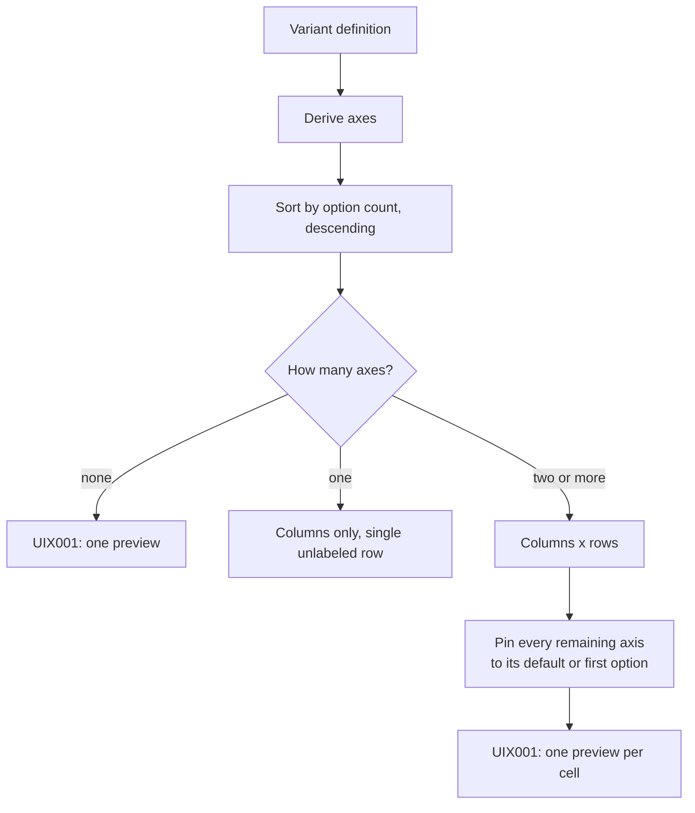

# Variant matrix grid

## Overview

The grid of previews showing a component's variants side by side. It is the answer to "what does this component actually look like", and it is what a Story file would otherwise have to enumerate by hand.

## Requirements

Satisfies, together with [UIC001](UIC001_props-table.md), from [ui](../requirements.md#ui):

> Show the variant matrix and a props table (name, type, required, default, description). _(Prototype)_

## Anatomy

A table whose columns and rows are two variant axes, with a preview iframe in every cell.

The `Button` in the example app declares `variant` with five options and `size` with three, so `variant` takes the columns:

```
┌─────────┬──────────┬───────────┬─────────────┬──────────┬──────────┐
│  size   │ default  │ secondary │ destructive │ outline  │ ghost    │
├─────────┼──────────┼───────────┼─────────────┼──────────┼──────────┤
│   sm    │ [Button] │ [Button]  │  [Button]   │ [Button] │ [Button] │
├─────────┼──────────┼───────────┼─────────────┼──────────┼──────────┤
│ default │ [Button] │ [Button]  │  [Button]   │ [Button] │ [Button] │
├─────────┼──────────┼───────────┼─────────────┼──────────┼──────────┤
│   lg    │ [Button] │ [Button]  │  [Button]   │ [Button] │ [Button] │
└─────────┴──────────┴───────────┴─────────────┴──────────┴──────────┘
    ↑          ↑
    │          └── variant: five options, so it takes the columns
    │
    └── size: three options, so it takes the rows. The corner cell
        carries its name. Any further axis is pinned to one value
        and never appears.

    Each cell is an iframe 90 px tall, rendering Button with its
    children set to the string "Button".
```

The axis names carry no meaning to thmh. `variant` and `size` are what this component's author happened to write; a component declaring `tone` and `density` produces the same grid with those names. What decides the layout is only how many options each axis has.

Axes are sorted by how many options they have, largest first. The largest becomes the columns, the second largest the rows, and every remaining axis is pinned to one value: its default, or its first option when it has no default.



The corner cell holds the row axis's name. Column headers hold the column options; row headers hold the row options. With only one axis, the row header column is present but empty.

Every cell passes the component's own name as its children, so a preview always has something to render.

## Behavior

The grid is computed once, when the page renders, and never changes. There is no way to choose which axes are shown, to change a pinned value, or to see a combination the grid does not display.

Frames load lazily, so cells outside the viewport are not fetched until scrolled to.

## A11y

**Header cells are `th`** for both the column headers and the row headers, which is the correct shape for a two-axis grid.

**No `scope` attributes.** In a grid with both row and column headers, association is genuinely ambiguous without them: a screen reader has to guess whether a `th` heads its row or its column. This matters more here than in [UIC001](UIC001_props-table.md), where a single header row makes the guess reliable.

**The corner cell is a `th` with the row axis's name**, which is right, but with one axis it is an empty `th` announcing nothing.

**The frames have no accessible name.** Every cell's iframe is unnamed, so a reader navigating frames encounters a row of identically anonymous ones. The cell's coordinates — which variant this actually is — exist only in the surrounding headers, and nothing carries them into the frame. This is the most consequential gap in the grid.

**Nothing states which axes were pinned.** A reader is shown a two-dimensional slice of a higher-dimensional matrix with no indication that a slice is what they are looking at.

## Design

Two axes on screen is a deliberate limit: a table is two-dimensional, and the alternative — nesting or repeating grids — costs more comprehension than it returns.

Sorting by option count puts the widest axis along the columns, which reads better left to right than top to bottom and keeps the table from becoming very tall.

Fixed-height frames keep rows aligned so the grid reads as a grid. The cost is a component that does not fit, which the Notes cover.

## Notes

**Axis derivation is duplicated here.** This grid re-implements the derivation that [ANA004](../analysis/ANA004_variant-matrix.md) already provides, rather than consuming the manifest's own. Two copies of one rule is exactly the duplication this project treats as a defect, and it is recorded against ANA004 as well. Resolving it means either recording the matrix in the manifest or having this consume the exported function.

**Frame height is a fixed 90 pixels.** A component taller than that is clipped with no scroll and no indication that anything was cut. A component much shorter sits in a mostly empty cell.

**Beyond two axes, most of the matrix is unreachable.** A component with three axes shows one slice, chosen by a rule the reader cannot see or change. The requirement calls for the full variant matrix, and what is displayed is a projection of it.

**Compound variants are invisible.** The manifest records them, and nothing here renders or mentions them, so a combination that produces different classes looks the same as one that does not.

**Passing the component name as children assumes it accepts children.** A component that renders nothing for unexpected children shows an empty cell, and one that requires a specific child type may error inside its frame.
