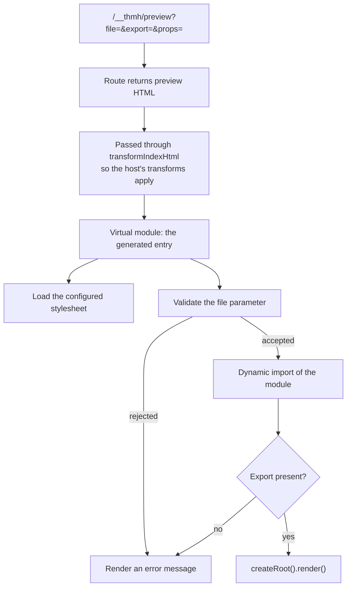

# Preview sandbox

## Overview

The isolated document that renders one component with one set of props. Every preview on the catalog page is an iframe pointing at it, which is what keeps a component's styles and scripts from leaking into the catalog's own.

## Requirements

Satisfies, from [ui](../requirements.md#ui):

> Render each variant in a sandboxed iframe. _(Prototype)_

## Anatomy

Three pieces: a URL, a route, and a generated module.

The URL carries three parameters: the component's file path, the export name, and the props as JSON. Everything the preview needs is in the URL, so a frame is fully described by its `src` and nothing is shared with the parent.

The route's HTML goes through the host's index-HTML transform. That is not cosmetic: React's Fast Refresh plugin injects a preamble there, and without it the component module throws on load.

The generated entry imports `react` and `react-dom/client` and renders through `createRoot`, so the host must supply both. That requirement is declared as a peer dependency of `@thmh/vite` ([INT001](../integration/INT001_vite-plugin.md)).

## Behavior

The file parameter is rejected when it is absent, absolute, contains `..`, or contains a colon. An accepted path is imported relative to the server root.

A missing export renders a message naming both the export and the file. Any error during import or render is caught and rendered as text. The frame always shows something; it never fails silently or blanks.

The stylesheet is imported in parallel with the component, not before it. A component therefore renders before its styles are guaranteed, and the styles arrive when they arrive. If the import fails, a hint naming the configured path and the option to change it is appended below the component.

## A11y

**The document declares `lang="en"` and carries a viewport meta tag**, like the catalog shell — and here the declaration is wrong more often than it is right. A preview renders the host's component and nothing else; thmh contributes text only when something fails. So unlike the catalog, this document should follow the host's language rather than thmh's. It does not yet, because nothing reads the host's `lang`. Recorded under [ui](../requirements.md#ui).

**There is no `main` landmark here, deliberately.** The frame holds one component and nothing else, so a region would name the whole document. Landmarks earn their place where a reader has somewhere else to go, and inside a preview there is nowhere.

**The frame follows the reader's colour scheme**, matching the catalog around it rather than staying light. A reader working in dark sees the component on the surface it will actually sit on. What that costs is stated in [UIP001](UIP001_catalog-page.md): a component built for a light surface looks wrong, and nothing here can tell the difference.

The document declares the scheme but paints no surface of its own. Its body stays transparent, and the visible background is the one the catalog gives the `iframe` element. Painting it here as well would put the same colour in two places, which is the sort of duplication that drifts.

**The frame is named by whoever embeds it.** A preview knows what it renders only through its URL, and the name a reader needs — which component, which variant — is what the caller already had when it built that URL. So the `title` belongs on the embedding side, and [UIC002](UIC002_variant-matrix-grid.md) supplies it. Opening a preview URL directly still gives an unnamed document, which is acceptable: nothing is navigating frames there.

**Error text is announced as an alert.** A failure renders into an element with `role="alert"`, so it reaches a screen reader whether it arrives before or after the frame is read, and it is distinguishable from a component that happens to render the same string. The stylesheet hint uses `role="status"` instead: it is worth hearing and not worth interrupting for.

**The rendered component's own accessibility is its author's.** Nothing here inspects or reports on it, which is a natural place for the catalog to grow: the frame is exactly where an automated check would run.

## Design

The iframe is the isolation boundary, chosen over shadow DOM or a same-document mount because it is the only option that isolates styles, scripts, and layout at once without cooperation from the component.

Passing state through the URL rather than through `postMessage` keeps a preview independently addressable: a frame can be opened on its own, linked to, or reloaded without the catalog running.

Errors render inside the frame rather than propagating outward, so one broken component costs its own cell and not the page.

## Notes

**The path guard is client-side and is not the security boundary.** It rejects the obvious traversal shapes, but the request is served by the host's dev server, whose own file-serving rules are what actually constrain reachable paths. The guard should be read as a check that produces a good error message, not as the control. That division is accepted: the dev server owns which paths are reachable, and duplicating that rule here would create a second answer to the same question.

**The colon rule blocks more than intended.** Rejecting any path containing a colon rules out protocol-like strings, and also any legitimate path containing one.

**Props and children are passed twice.** The props object is spread into the element and `props.children` is also passed as the child argument, which wins. The duplication is harmless today and would matter to anyone changing how children are supplied.

**A missing mount point fails quietly.** Rendering into a missing element throws, the catch tries to render the error into the same missing element, and nothing appears at all.

**The generated module is a string.** It is assembled by concatenation rather than written as a file, so it is not type-checked, not linted, and not covered by any test.

**The frame and the catalog stay in the same colour scheme by coincidence, not by agreement.** Both read `prefers-color-scheme`, so they match as long as neither can be overridden. The moment UIC003 lets a reader choose a scheme, the catalog will have to tell the frame which one — through the URL, like everything else a preview knows.
