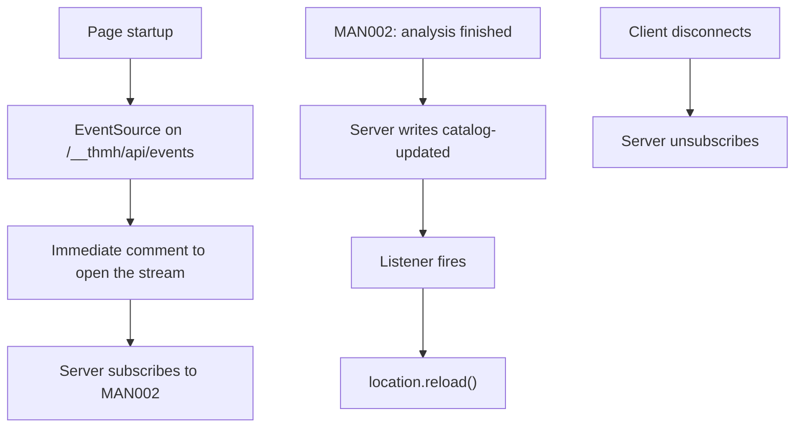

# Live reload

## Overview

Keeps the open catalog in step with the code. When analysis produces a new manifest, the page finds out and updates, without anyone reaching for the reload button.

## Requirements

Satisfies, from [ui](../requirements.md#ui):

> Live-reload the catalog when the manifest changes. _(Prototype)_

## Anatomy

A server-sent event stream and one listener.

The response is headed as an event stream, uncached, with the connection kept alive — which is what lets the browser hold it open and reconnect on its own. A comment goes out immediately, so the connection is established rather than merely accepted, and only then does the server subscribe. After that the stream carries one event type, `catalog-updated`, with an empty payload — a notification, not a delivery.

The server subscribes to the analyzer on connect and unsubscribes when the request closes, so a closed tab does not leave a subscriber behind.

## Behavior

The event carries no data, so the page has to go and get the new state. It does that by reloading the whole document.

Reloading is what makes this correct without any diffing: everything is rebuilt from the fetched catalog, and no stale state can survive. It is also why the cost is what it is.

Reconnection is the browser's. `EventSource` retries a dropped stream on its own, so a restarted dev server reconnects without intervention. Nothing catches up on events missed while disconnected, but since the event carries no data and the page refetches everything, nothing needs to.

## A11y

**A reload discards everything about where the reader was.** Scroll position, focus, and any expanded browser UI are lost. For a keyboard or screen-reader user deep in a long catalog, an edit somewhere in the project returns them to the top of the document with focus reset — an interruption they did not initiate and cannot predict.

**Nothing announces the update.** There is no live region and no message; the page simply becomes a different page. A sighted reader may notice the flash, and a screen-reader user gets no signal at all beyond their position vanishing.

**There is no way to opt out.** Nothing pauses or disables live reload, so a reader who needs a stable page while working through it has no recourse.

## Design

A notification rather than a payload is the right shape here: the manifest is the source of truth and it is already served over HTTP, so sending it twice would create a second copy that could disagree with the first.

Reloading over re-rendering is a prototype's trade, and an honest one — it is a few lines instead of a diffing layer, and it cannot be wrong. What it costs is exactly the reader's place in the page, which the A11y section states.

## Notes

**Re-rendering instead of reloading is the obvious next step**, and it is where the accessibility cost above goes away. It needs the page to rebuild from a refetched catalog while preserving scroll and focus, which is a real change to [UIP001](UIP001_catalog-page.md) rather than a change here.

**Every analysis notifies, whether or not anything changed.** The analyzer signals on completion, not on difference, so editing a comment in an unrelated file reloads the catalog. Comparing manifests before notifying would quiet this, and needs a manifest that is stable across runs — which it is not, since it carries a generation timestamp ([MAN003](../manifest/MAN003_catalog-generation.md)).

**A failed analysis also reloads**, into a catalog that is empty except for the error, because that is what [MAN002](../manifest/MAN002_dev-manifest-refresh.md) produces on failure. One bad edit clears the page.

**Nothing surfaces the connection state.** A dropped stream that fails to reconnect leaves a page that looks current and is not, with no indication either way.
